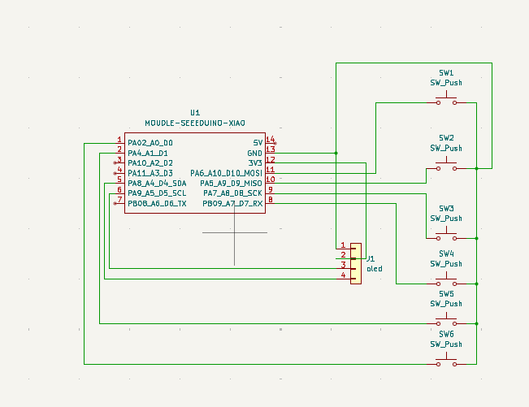

# Goosepad

A custom 6-key macro pad powered by the Seeed XIAO RP2040 and running QMK Firmware.

Goosepad is a compact DIY hackpad designed for shortcuts, macros, and custom controls. It features six individually wired keys, an OLED status display, and a custom PCB with a 3D printed case.
## Features

- 6 programmable keys
- Seeed XIAO RP2040 controller
- QMK Firmware support
- 0.91" 128x32 OLED display
- Custom PCB
- Custom 3D printed case
- Direct GPIO button wiring (no matrix)

## CAD
Used fusion 360 to design the case.
The case is divided into three parts:
- Bottom.stl
- Middle.stl
- Top.stl

## Schematic
I created the schematic in KiCad, here it is:

## PCB Design
This is my pcb design that i created in KiCad,it was really fun and chill tracing the pcb:

## Firmware
This hackpad uses QMK firmware for everything.
-6 programmable switches that can control anything you want :)
-OLED display that can display anything
## BOM (Bill of Materials)
-6x cherry MX switches
-1x 0.91" 128x32 OLED Display
-3D printed case
-PCB
-4x M3x16mm SHCS Bolts
-1x XIAO RP2040

## Yeah that is probably it
-that was everything I hope that it gets approved.
